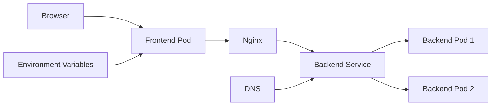

# Service Discovery Overview

## 🎯 What is Service Discovery?

Service discovery is the mechanism by which services in a distributed system can find and communicate with each other without hardcoding network locations.

### 🤔 The Problem Service Discovery Solves

In traditional applications, you might hardcode IPs:
```bash
# Bad - Hardcoded IP addresses
DATABASE_URL="http://192.168.1.100:5432"
API_URL="http://10.0.1.50:8000"
```

**Problems with hardcoding:**
- IPs change when pods restart
- Different IPs in different environments
- No load balancing
- Manual configuration nightmare

### ✅ Service Discovery Solution

Instead, use service names:
```bash
# Good - Service names
DATABASE_URL="http://postgres-service:5432" 
API_URL="http://backend-service:8000"
```

## 🏗️ How Kubernetes Implements Service Discovery

Kubernetes provides **two primary methods**:

### 1. Environment Variables (Automatic)
```bash
# Kubernetes automatically injects these:
BACKEND_SERVICE_HOST=10.96.1.50
BACKEND_SERVICE_PORT=8000
KUBERNETES_SERVICE_HOST=10.96.0.1
```

### 2. DNS (Recommended)
```bash
# Use DNS names that automatically resolve:
http://backend-service.namespace.svc.cluster.local:8000
http://backend-service:8000  # shorthand in same namespace
```

## 🎪 Real Example: Our DevOps Dojo App

### Without Service Discovery (Docker Compose)
```yaml
# docker-compose.yml
services:
  frontend:
    environment:
      - BACKEND_URL=http://backend:8000  # Hardcoded service name
```

### With Service Discovery (Kubernetes)
```bash
# frontend/docker-entrypoint.sh
if [ -n "$KUBERNETES_SERVICE_HOST" ]; then
    # Automatically discovers backend service
    BACKEND_URL="http://backend.${NAMESPACE}.svc.cluster.local:8000"
fi
```

## 🔄 Service Discovery Lifecycle

1. **Service Creation**: You deploy a service with `kubectl apply`
2. **DNS Registration**: Kubernetes registers service in cluster DNS
3. **Environment Injection**: Kubelet injects environment variables in all pods
4. **Service Resolution**: Apps can now find services by name
5. **Load Balancing**: Kubernetes automatically load balances requests

## 🏆 Benefits

| Benefit | Description | Example |
|---------|-------------|---------|
| **Dynamic** | Services can move, scale, restart | Pod IPs change, service name stays same |
| **Environment Agnostic** | Same code works dev/staging/prod | No config changes needed |
| **Load Balanced** | Automatic load balancing | Multiple backend pods = automatic LB |
| **Health Aware** | Only routes to healthy pods | Unhealthy pods removed from rotation |

## 🔍 Service Discovery in Action

Let's trace a request in our application:



1. **Browser** → Frontend Service (via Ingress)
2. **Frontend Pod** → Checks environment variables
3. **Nginx** → Proxies `/api` requests using DNS
4. **Backend Service** → Load balances to healthy backend pods

## 🔗 Next Steps

- Learn about [Environment Variables Method](./02-environment-variables.md)
- Explore [DNS-Based Discovery](./03-dns-service-discovery.md)
- See [Practical Examples](./04-practical-examples.md) from our app

---

Service discovery transforms chaotic hardcoded connections into elegant, self-organizing communication! 🚀