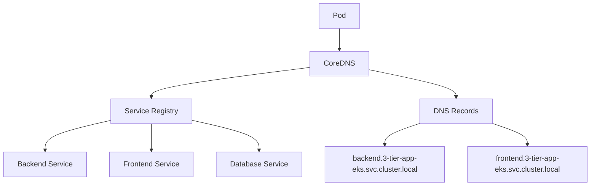

# DNS-Based Service Discovery

## 🌐 What is DNS-Based Service Discovery?

Kubernetes runs an internal DNS server (CoreDNS) that automatically creates DNS records for all services. This allows pods to find services using domain names instead of IP addresses.

## 🏗️ DNS Architecture in Kubernetes



## 📝 DNS Naming Convention

### Full Qualified Domain Name (FQDN)
```bash
<service-name>.<namespace>.svc.cluster.local
```

### Examples from Our App
```bash
# Backend service in 3-tier-app-eks namespace
backend.3-tier-app-eks.svc.cluster.local

# Frontend service  
frontend.3-tier-app-eks.svc.cluster.local

# Database service
postgres-db.3-tier-app-eks.svc.cluster.local
```

### Shorthand Forms
```bash
# Within same namespace, you can use shortcuts:
backend                    # Short form
backend.3-tier-app-eks     # Medium form  
backend.3-tier-app-eks.svc.cluster.local  # Full FQDN
```

## 🎯 How Our DevOps Dojo App Uses DNS

### Frontend Service Discovery Logic

**File: `frontend/docker-entrypoint.sh`**
```bash
if [ -n "$KUBERNETES_SERVICE_HOST" ]; then
    # Kubernetes detected - use DNS-based discovery
    NAMESPACE=${NAMESPACE:-3-tier-app-eks}
    BACKEND_URL="http://backend.${NAMESPACE}.svc.cluster.local:8000"
else
    # Docker Compose - use simple service names
    BACKEND_URL="http://backend:8000"  
fi
```

### Generated Nginx Configuration

**File: `frontend/nginx.conf.template`**
```nginx
server {
    listen 80;
    
    location /api {
        # ${BACKEND_URL} gets replaced with:
        # http://backend.3-tier-app-eks.svc.cluster.local:8000
        proxy_pass ${BACKEND_URL};
        proxy_set_header Host $host;
        # ... other headers
    }
}
```

## 🔍 DNS Resolution in Action

### Step-by-Step Resolution
```bash
# 1. Frontend container makes API call
curl http://backend.3-tier-app-eks.svc.cluster.local:8000/api/topics

# 2. Container queries CoreDNS
nslookup backend.3-tier-app-eks.svc.cluster.local

# 3. CoreDNS returns service ClusterIP
# Name: backend.3-tier-app-eks.svc.cluster.local  
# Address: 10.96.87.123

# 4. Request goes to ClusterIP
curl http://10.96.87.123:8000/api/topics

# 5. Service load balances to backend pods
```

## 🧪 Practical Testing

### Test DNS Resolution from Pod
```bash
# Get shell in frontend pod
kubectl exec -it -n 3-tier-app-eks deployment/frontend -- /bin/bash

# Test different DNS forms
nslookup backend
nslookup backend.3-tier-app-eks  
nslookup backend.3-tier-app-eks.svc.cluster.local

# All should resolve to same ClusterIP!
```

### Test Service Connectivity  
```bash
# From within frontend pod
curl http://backend:8000/api/topics
curl http://backend.3-tier-app-eks.svc.cluster.local:8000/api/topics

# Both should return same JSON response
```

## 🔧 DNS Configuration Deep Dive

### CoreDNS ConfigMap
```bash
# View CoreDNS configuration
kubectl get configmap coredns -n kube-system -o yaml
```

**Key configurations:**
```yaml
data:
  Corefile: |
    .:53 {
        kubernetes cluster.local in-addr.arpa ip6.arpa {
            pods insecure
            fallthrough in-addr.arpa ip6.arpa
        }
        # ...
    }
```

### Service DNS Records Created
When you create our backend service:
```yaml
apiVersion: v1
kind: Service
metadata:
  name: backend
  namespace: 3-tier-app-eks
spec:
  ports:
  - port: 8000
    targetPort: 8000
  selector:
    app: backend
```

**CoreDNS automatically creates:**
```bash
# A record
backend.3-tier-app-eks.svc.cluster.local → 10.96.87.123

# SRV record  
_http._tcp.backend.3-tier-app-eks.svc.cluster.local → 8000

# Reverse DNS
123.87.96.10.in-addr.arpa → backend.3-tier-app-eks.svc.cluster.local
```

## 🚀 Advanced DNS Features

### Cross-Namespace Service Access
```bash
# Access service in different namespace
http://backend.other-namespace.svc.cluster.local:8000
```

### External Service Discovery
```yaml
# Create ExternalName service for external API
apiVersion: v1
kind: Service
metadata:
  name: external-api
spec:
  type: ExternalName
  externalName: api.github.com
```

```bash
# Now pods can use:
curl http://external-api.3-tier-app-eks.svc.cluster.local
# Resolves to api.github.com
```

### Headless Services (Pod Discovery)
```yaml
apiVersion: v1
kind: Service
metadata:
  name: backend-headless
spec:
  clusterIP: None  # Headless service
  selector:
    app: backend
```

```bash
# Returns individual pod IPs, not service IP
nslookup backend-headless.3-tier-app-eks.svc.cluster.local

# Response:
# backend-headless.3-tier-app-eks.svc.cluster.local
# Address: 10.244.1.10  (pod 1)
# Address: 10.244.2.15  (pod 2)
```

## ⚡ Performance Considerations

### DNS Caching
```bash
# Check DNS cache in pod
cat /etc/resolv.conf

# Typical output:
nameserver 10.96.0.10
search 3-tier-app-eks.svc.cluster.local svc.cluster.local cluster.local
options ndots:5
```

### DNS Query Optimization
```bash
# Efficient: Use full FQDN to avoid search list traversal
curl http://backend.3-tier-app-eks.svc.cluster.local:8000

# Less efficient: Triggers multiple DNS queries  
curl http://backend:8000
# Tries: backend.3-tier-app-eks.svc.cluster.local.
#        backend.svc.cluster.local.
#        backend.cluster.local.
#        backend.
```

## 🛠️ Troubleshooting DNS Issues

### Common Problems & Solutions

#### 1. Service Not Resolving
```bash
# Check if service exists
kubectl get svc -n 3-tier-app-eks backend

# Check if CoreDNS is running
kubectl get pods -n kube-system -l k8s-app=kube-dns
```

#### 2. Wrong Namespace
```bash
# Wrong - looks in default namespace
curl http://backend:8000

# Right - specify namespace  
curl http://backend.3-tier-app-eks:8000
```

#### 3. DNS Resolution Testing
```bash
# Test from same pod
kubectl exec -n 3-tier-app-eks deployment/frontend -- nslookup backend

# Test DNS server directly
kubectl exec -n 3-tier-app-eks deployment/frontend -- nslookup backend 10.96.0.10
```

## 📊 DNS vs Environment Variables Comparison

| Aspect | DNS | Environment Variables |
|--------|-----|---------------------|
| **Discovery** | Dynamic | Static (restart required) |
| **Performance** | DNS lookup overhead | Direct access |
| **Flexibility** | Cross-namespace support | Same cluster only |
| **Readability** | Human-friendly names | Technical variables |
| **New Services** | Immediate availability | Requires pod restart |

## 🎓 Best Practices

1. **Use FQDN in production** for clarity and performance
2. **Implement DNS caching** in your applications  
3. **Handle DNS failures gracefully** with retries
4. **Use headless services** for direct pod communication
5. **Monitor DNS performance** with metrics

## 🔗 Integration with Our App

Our application demonstrates perfect DNS integration:

1. **Environment Detection**: Uses `KUBERNETES_SERVICE_HOST` to detect Kubernetes
2. **Dynamic URL Generation**: Builds DNS names using namespace
3. **Nginx Proxying**: Leverages DNS for backend service discovery  
4. **Cross-Environment Compatibility**: Same container works in Docker Compose and K8s

## 🔗 Next Steps

- See [Practical Examples](./04-practical-examples.md) with real code from our app
- Learn about [Service Types](./05-service-types.md) and their discovery patterns
- Check the [Troubleshooting Guide](./06-troubleshooting.md) for common issues

---

DNS transforms Kubernetes into a self-discovering network of services! 🌐