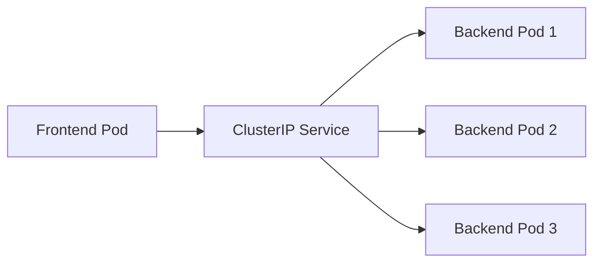

# Service Types and Discovery Patterns

## 🏗️ Kubernetes Service Types Overview

Kubernetes provides different service types, each with unique discovery patterns and use cases.

## 📋 Service Types Comparison

| Type | Discovery Method | Use Case | External Access |
|------|------------------|----------|-----------------|
| **ClusterIP** | DNS + Environment Variables | Internal communication | ❌ Internal only |
| **NodePort** | DNS + Node IP:Port | Development/Testing | ✅ Via Node IP |
| **LoadBalancer** | DNS + External IP | Production external access | ✅ Via Cloud LB |
| **ExternalName** | DNS CNAME | External service proxy | ✅ External service |

## 1️⃣ ClusterIP Services (Default)

### Our Implementation
```yaml
# k8s/backend.yaml
apiVersion: v1
kind: Service
metadata:
  name: backend
  namespace: 3-tier-app-eks
spec:
  type: ClusterIP  # Default, can be omitted
  selector:
    app: backend
  ports:
  - port: 8000
    targetPort: 8000
```

### Service Discovery
```bash
# DNS resolution
backend.3-tier-app-eks.svc.cluster.local → 10.96.87.123 (ClusterIP)

# Environment variables  
BACKEND_SERVICE_HOST=10.96.87.123
BACKEND_SERVICE_PORT=8000

# Usage in pods
curl http://backend:8000/api/topics
curl http://backend.3-tier-app-eks.svc.cluster.local:8000/api/topics
```

### Characteristics
- ✅ **Internal only**: Not accessible from outside cluster
- ✅ **Load balanced**: Distributes traffic across pods  
- ✅ **Stable IP**: ClusterIP remains constant
- ✅ **DNS enabled**: Full DNS resolution support

## 2️⃣ NodePort Services

### Example Configuration
```yaml
apiVersion: v1
kind: Service
metadata:
  name: frontend-nodeport
  namespace: 3-tier-app-eks
spec:
  type: NodePort
  selector:
    app: frontend
  ports:
  - port: 80
    targetPort: 80
    nodePort: 30080  # Optional, auto-assigned if omitted
```

### Service Discovery
```bash
# Internal discovery (same as ClusterIP)
frontend-nodeport.3-tier-app-eks.svc.cluster.local → 10.96.45.67

# External access via any node
http://<node-ip>:30080

# Environment variables
FRONTEND_NODEPORT_SERVICE_HOST=10.96.45.67
FRONTEND_NODEPORT_SERVICE_PORT=80
FRONTEND_NODEPORT_SERVICE_PORT_HTTP=30080
```

### Use Cases
- 🧪 **Development**: Quick external access
- 🔧 **Testing**: Access services from outside cluster
- 📊 **Monitoring**: External monitoring tools
- ⚠️ **Not Production**: Security and port management issues

## 3️⃣ LoadBalancer Services

### Our Ingress Alternative
```yaml
apiVersion: v1
kind: Service
metadata:
  name: frontend-lb
  namespace: 3-tier-app-eks
spec:
  type: LoadBalancer
  selector:
    app: frontend
  ports:
  - port: 80
    targetPort: 80
```

### Service Discovery
```bash
# Internal discovery
frontend-lb.3-tier-app-eks.svc.cluster.local → 10.96.45.67

# External access (after cloud provisioning)
http://<external-ip>:80

# Check external IP
kubectl get svc frontend-lb -n 3-tier-app-eks
# NAME          TYPE           CLUSTER-IP    EXTERNAL-IP      PORT(S)
# frontend-lb   LoadBalancer   10.96.45.67   52.23.45.67     80:32000/TCP
```

### Environment Variables
```bash
FRONTEND_LB_SERVICE_HOST=10.96.45.67
FRONTEND_LB_SERVICE_PORT=80
FRONTEND_LB_SERVICE_PORT_HTTP=80
```

### Cloud Integration
**AWS EKS:**
```yaml
metadata:
  annotations:
    service.beta.kubernetes.io/aws-load-balancer-type: "nlb"
    service.beta.kubernetes.io/aws-load-balancer-scheme: "internet-facing"
```

**GCP GKE:**
```yaml
metadata:
  annotations:
    cloud.google.com/load-balancer-type: "External"
```

## 4️⃣ ExternalName Services

### External Service Proxy
```yaml
apiVersion: v1
kind: Service
metadata:
  name: github-api
  namespace: 3-tier-app-eks
spec:
  type: ExternalName
  externalName: api.github.com
  ports:
  - port: 443
```

### Service Discovery
```bash
# DNS resolution
github-api.3-tier-app-eks.svc.cluster.local → api.github.com (CNAME)

# Usage in pods
curl https://github-api.3-tier-app-eks.svc.cluster.local/user

# Environment variables (limited)
# Note: ExternalName services don't get full environment variable support
```

### Use Cases
- 🌐 **External APIs**: Proxy external services
- 🔄 **Migration**: Gradually move services
- 🏢 **Legacy Systems**: Access old systems with new names
- 📦 **Abstraction**: Hide external service details

## 🎯 Service Discovery Patterns by Type

### Pattern 1: Internal Microservices (ClusterIP)


**Implementation:**
```bash
# Service-to-service communication
curl http://backend.3-tier-app-eks.svc.cluster.local:8000/api/topics
```

### Pattern 2: External Access (LoadBalancer/Ingress)


**Our Implementation:**
```yaml
# We use Ingress instead of LoadBalancer
apiVersion: networking.k8s.io/v1
kind: Ingress
metadata:
  name: 3-tier-app-ingress
spec:
  rules:
  - http:
      paths:
      - path: /api
        backend:
          service:
            name: backend
            port:
              number: 8000
      - path: /
        backend:
          service:
            name: frontend
            port:
              number: 80
```

### Pattern 3: Database Access (ClusterIP + StatefulSet)
```yaml
# Database service
apiVersion: v1  
kind: Service
metadata:
  name: postgres-db
  namespace: 3-tier-app-eks
spec:
  selector:
    app: postgres
  ports:
  - port: 5432
    targetPort: 5432
  clusterIP: None  # Headless service for StatefulSet
```

**Discovery Pattern:**
```bash
# Headless service returns individual pod IPs
postgres-db.3-tier-app-eks.svc.cluster.local
# Returns: postgres-db-0.postgres-db.3-tier-app-eks.svc.cluster.local
```

## 🔧 Advanced Service Discovery Features

### 1. Multi-Port Services
```yaml
apiVersion: v1
kind: Service  
metadata:
  name: multi-port-service
spec:
  selector:
    app: backend
  ports:
  - name: http
    port: 8000
    targetPort: 8000
  - name: metrics  
    port: 9090
    targetPort: 9090
  - name: debug
    port: 8080
    targetPort: 8080
```

**Environment Variables Generated:**
```bash
MULTI_PORT_SERVICE_SERVICE_HOST=10.96.87.123
MULTI_PORT_SERVICE_SERVICE_PORT=8000  # First port
MULTI_PORT_SERVICE_SERVICE_PORT_HTTP=8000
MULTI_PORT_SERVICE_SERVICE_PORT_METRICS=9090  
MULTI_PORT_SERVICE_SERVICE_PORT_DEBUG=8080
```

### 2. Session Affinity
```yaml
apiVersion: v1
kind: Service
metadata:
  name: sticky-service
spec:
  sessionAffinity: ClientIP
  sessionAffinityConfig:
    clientIP:
      timeoutSeconds: 10800  # 3 hours
  selector:
    app: backend
  ports:
  - port: 8000
```

### 3. Topology Aware Routing
```yaml  
apiVersion: v1
kind: Service
metadata:
  name: topology-aware-service
  annotations:
    service.kubernetes.io/topology-aware-hints: auto
spec:
  selector:
    app: backend
  ports:
  - port: 8000
```

## 🧪 Testing Different Service Types

### Test ClusterIP Discovery
```bash
# Deploy ClusterIP service
kubectl apply -f - <<EOF
apiVersion: v1
kind: Service
metadata:
  name: test-clusterip
  namespace: 3-tier-app-eks
spec:
  selector:
    app: backend
  ports:
  - port: 8000
EOF

# Test DNS resolution
kubectl exec -n 3-tier-app-eks deployment/frontend -- nslookup test-clusterip

# Test connectivity
kubectl exec -n 3-tier-app-eks deployment/frontend -- curl http://test-clusterip:8000/api/topics
```

### Test LoadBalancer Discovery  
```bash
# Create LoadBalancer service
kubectl apply -f - <<EOF
apiVersion: v1
kind: Service
metadata:
  name: test-loadbalancer
  namespace: 3-tier-app-eks
spec:
  type: LoadBalancer
  selector:
    app: frontend
  ports:
  - port: 80
EOF

# Wait for external IP
kubectl get svc test-loadbalancer -n 3-tier-app-eks -w

# Test external access
curl http://<external-ip>/
```

## 📊 Service Discovery Performance

### DNS Resolution Times
| Service Type | Resolution Time | Caching |
|-------------|----------------|---------|
| **Short name** (backend) | ~1-5ms | ✅ |
| **Namespace** (backend.ns) | ~2-8ms | ✅ |
| **FQDN** (backend.ns.svc.cluster.local) | ~1-3ms | ✅ |
| **Environment Variables** | ~0ms | N/A |

### Optimization Tips
```bash
# Fastest: Use environment variables for static discovery
curl http://$BACKEND_SERVICE_HOST:$BACKEND_SERVICE_PORT/api/topics

# Fast: Use FQDN to avoid search list
curl http://backend.3-tier-app-eks.svc.cluster.local:8000/api/topics

# Slower: Short name triggers search list traversal
curl http://backend:8000/api/topics
```

## 🏆 Best Practices by Service Type

### ClusterIP (Internal Services)
- ✅ Use for all internal service-to-service communication
- ✅ Prefer DNS over environment variables for flexibility
- ✅ Use FQDN in production for clarity
- ✅ Monitor service health with readiness probes

### NodePort (Development Only)  
- ⚠️ Only for development and testing
- ⚠️ Be aware of port conflicts
- ⚠️ Not suitable for production security requirements

### LoadBalancer (External Access)
- ✅ Good for simple external access
- ⚠️ Can be expensive (cloud LB per service)
- ✅ Consider Ingress for multiple services
- ✅ Use cloud-specific annotations for optimization

### ExternalName (External Integration)
- ✅ Perfect for gradual service migration
- ✅ Good for abstracting external dependencies  
- ⚠️ Limited Kubernetes service features
- ✅ Useful for environment-specific external services

## 🔗 Our DevOps Dojo Implementation

We primarily use **ClusterIP** services with **Ingress** for external access:

```yaml
# Internal communication: ClusterIP
backend.3-tier-app-eks.svc.cluster.local:8000

# External access: Ingress → ClusterIP  
Internet → ALB → frontend:80 → backend:8000
```

This pattern provides:
- 💰 **Cost Effective**: Single load balancer for multiple services
- 🔒 **Secure**: Internal services not directly exposed
- 🚀 **Scalable**: Kubernetes-native load balancing
- 🔧 **Flexible**: Easy to add new services

## 🔗 Next Steps

- Learn [Troubleshooting](./06-troubleshooting.md) techniques for service discovery issues
- Explore advanced networking concepts like service mesh
- Practice with different service types in your own cluster

---

Choose the right service type for the right job! 🎯