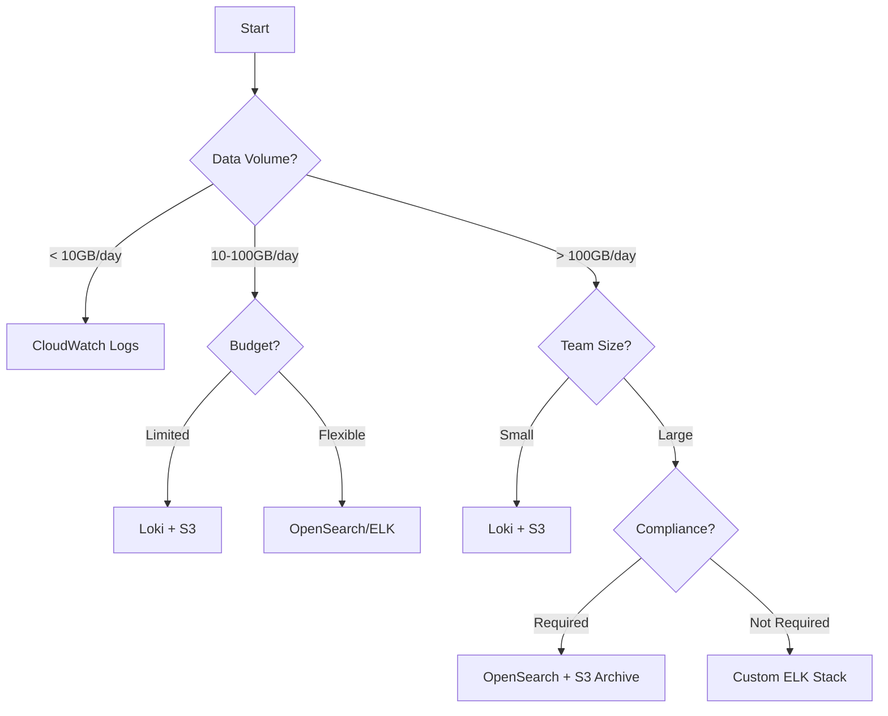

# Comprehensive Production Monitoring Concepts and Implementation Guide

## Table of Contents
1. [Executive Summary](#executive-summary)
2. [Monitoring Philosophy](#monitoring-philosophy)
3. [Log Storage Architecture Decision Matrix](#log-storage-architecture-decision-matrix)
4. [Cost Analysis Deep Dive](#cost-analysis-deep-dive)
5. [Implementation Roadmap](#implementation-roadmap)
6. [Production Patterns](#production-patterns)
7. [Real-World Scenarios](#real-world-scenarios)
8. [Tool Comparison Matrix](#tool-comparison-matrix)
9. [Migration Strategies](#migration-strategies)
10. [Future-Proofing Your Monitoring](#future-proofing-your-monitoring)

## Executive Summary

This document provides a comprehensive guide for implementing production-grade monitoring in Kubernetes environments, with specific focus on EKS. It covers the decision-making process, cost optimization strategies, and real-world implementation patterns.

### Key Takeaways

```yaml
For Small Teams (< 50 developers):
  Recommendation: PLG Stack (Prometheus + Loki + Grafana)
  Cost: $100-200/month
  Complexity: Medium
  Time to Value: 1-2 days

For Medium Teams (50-200 developers):
  Recommendation: Hybrid (PLG + CloudWatch for critical paths)
  Cost: $500-1000/month
  Complexity: Medium-High
  Time to Value: 1 week

For Large Teams (> 200 developers):
  Recommendation: Enterprise (Datadog/New Relic or self-managed with dedicated SRE team)
  Cost: $2000+/month
  Complexity: High
  Time to Value: 2-4 weeks
```

## Monitoring Philosophy

### The Observability Pyramid

```
                 ┌─────────┐
                 │Business │  <- Business KPIs, Revenue Impact
                 │Metrics  │
                ┌┴─────────┴┐
                │    SLOs    │  <- User-facing objectives
               ┌┴───────────┴┐
               │     SLIs     │  <- Service Level Indicators
              ┌┴─────────────┴┐
              │  Golden Signals│  <- Latency, Traffic, Errors, Saturation
             ┌┴───────────────┴┐
             │  Infrastructure  │  <- CPU, Memory, Disk, Network
            └───────────────────┘
```

### Monitoring Maturity Model

```yaml
Level 1 - Reactive (Firefighting):
  Characteristics:
    - Manual checks
    - No alerting
    - Logs only when issues occur
  Tools: kubectl logs, CloudWatch basic

Level 2 - Proactive (Basic Monitoring):
  Characteristics:
    - Basic metrics collection
    - Simple alerting
    - Centralized logging
  Tools: Prometheus + Grafana basics

Level 3 - Observant (Full Observability):
  Characteristics:
    - Distributed tracing
    - Custom metrics
    - SLO tracking
  Tools: PLG + Jaeger + ServiceMesh

Level 4 - Predictive (AI/ML-Driven):
  Characteristics:
    - Anomaly detection
    - Predictive scaling
    - Automated remediation
  Tools: PLG + Prometheus ML + Karpenter

Level 5 - Autonomous (Self-Healing):
  Characteristics:
    - Auto-remediation
    - Chaos engineering
    - Continuous optimization
  Tools: Full platform with AIOps
```

## Log Storage Architecture Decision Matrix

### Decision Framework



### Detailed Comparison

| Solution | Setup Time | Operational Overhead | Cost/GB | Query Speed | Retention | Best For |
|----------|-----------|---------------------|---------|-------------|-----------|----------|
| **CloudWatch Logs** | 5 min | None | $0.50 | Medium | 30d default | AWS-native, small scale |
| **Loki + S3** | 2 hours | Low | $0.03 | Fast for recent | Unlimited | Cost-conscious, Kubernetes |
| **ELK Self-Managed** | 2 days | High | $0.10 | Very Fast | Based on storage | Full control needed |
| **OpenSearch (AWS)** | 30 min | Medium | $0.20 | Very Fast | Based on storage | Enterprise search needs |
| **Datadog** | 10 min | None | $0.75 | Fast | 15d default | Quick setup, full service |
| **Splunk** | 1 week | Medium | $1.00+ | Very Fast | Configurable | Large enterprise |

### Storage Strategy by Log Type

```yaml
Log Categories and Storage:
  
  Application Logs:
    Retention: 30 days
    Storage: Loki + S3
    Sampling: 100% for errors, 10% for info
    Cost: ~$0.05/GB
  
  Audit Logs:
    Retention: 7 years
    Storage: CloudWatch → S3 Glacier
    Sampling: Never (compliance)
    Cost: ~$0.004/GB after 90 days
  
  Access Logs:
    Retention: 90 days
    Storage: S3 + Athena
    Sampling: 100%
    Cost: ~$0.023/GB + query costs
  
  Debug Logs:
    Retention: 7 days
    Storage: Loki (no S3)
    Sampling: 1% in production
    Cost: ~$0.01/GB
  
  Security Logs:
    Retention: 1 year
    Storage: CloudWatch + S3
    Sampling: Never
    Cost: ~$0.10/GB (worth the cost)
```

## Cost Analysis Deep Dive

### Real Production Costs - 1000 User SaaS Application

```yaml
Scenario: B2B SaaS with 1000 active users
Traffic: 10M requests/day
Data Generated: 50GB logs/day, 10GB metrics/day

Option 1: Full CloudWatch
  CloudWatch Logs:
    Ingestion: 50GB * 30 * $0.50 = $750/month
    Storage: 1.5TB * $0.03 = $45/month
    Insights: 100GB queries * $0.005 = $0.50/month
  CloudWatch Metrics:
    Custom Metrics: 1000 * $0.30 = $300/month
    API Requests: $10/month
  Container Insights: $50/month
  Total: ~$1,155/month

Option 2: PLG Stack (Recommended)
  Infrastructure:
    3x t3.large for monitoring = $150/month
    EBS Storage (500GB GP3) = $40/month
  Loki Storage (S3):
    1.5TB * $0.023 = $35/month
  Prometheus Storage (EBS):
    300GB * $0.08 = $24/month
  Total: ~$249/month (78% savings)

Option 3: Hybrid Approach
  Critical Logs (CloudWatch): 
    5GB/day * 30 * $0.50 = $75/month
  Bulk Logs (Loki):
    45GB/day → S3 = $31/month
  Metrics (Prometheus): $24/month
  Infrastructure: $150/month
  Total: ~$280/month (76% savings)
```

### Cost Optimization Strategies

```yaml
Quick Wins (Implement Today):
  1. Log Level Filtering:
     Impact: 40-60% reduction
     Implementation: Set production log level to WARN
     Savings: $300-500/month
  
  2. Metric Cardinality Control:
     Impact: 30% reduction in Prometheus memory
     Implementation: Drop unused labels
     Savings: $50-100/month
  
  3. Retention Policies:
     Impact: 50% storage cost reduction
     Implementation: 7d hot, 30d warm, 1y cold
     Savings: $200-300/month

Medium-Term (1-3 months):
  1. Log Sampling:
     Implementation: Sample 10% of INFO logs
     Savings: $200-400/month
  
  2. Metric Aggregation:
     Implementation: Pre-aggregate with recording rules
     Savings: $100-200/month
  
  3. Compression:
     Implementation: Enable Loki compression
     Savings: $50-100/month

Long-Term (3-6 months):
  1. Tiered Storage:
     Implementation: S3 + Glacier for archives
     Savings: $300-500/month
  
  2. Reserved Instances:
     Implementation: Reserve monitoring nodes
     Savings: $50-75/month
  
  3. Spot Instances:
     Implementation: Use spot for non-critical monitoring
     Savings: $75-100/month
```

## Implementation Roadmap

### Week 1: Foundation

```bash
# Day 1-2: Infrastructure Setup
- [ ] Create monitoring namespace
- [ ] Set up storage classes
- [ ] Configure RBAC
- [ ] Install Prometheus Operator

# Day 3-4: Metrics Collection
- [ ] Deploy Prometheus
- [ ] Configure ServiceMonitors
- [ ] Set up Node Exporters
- [ ] Test metric collection

# Day 5: Visualization
- [ ] Install Grafana
- [ ] Import base dashboards
- [ ] Configure data sources
- [ ] Create team access
```

### Week 2: Logging and Alerting

```bash
# Day 1-2: Log Aggregation
- [ ] Deploy Loki
- [ ] Configure Promtail
- [ ] Set up log parsing
- [ ] Test log queries

# Day 3-4: Alerting
- [ ] Configure AlertManager
- [ ] Create alert rules
- [ ] Set up notification channels
- [ ] Test alert flow

# Day 5: Integration
- [ ] Connect all components
- [ ] Create unified dashboards
- [ ] Document runbooks
- [ ] Team training
```

### Week 3: Application Integration

```bash
# Day 1-2: Application Metrics
- [ ] Add Prometheus libraries
- [ ] Instrument code
- [ ] Create custom metrics
- [ ] Deploy changes

# Day 3-4: Structured Logging
- [ ] Implement JSON logging
- [ ] Add correlation IDs
- [ ] Configure log levels
- [ ] Test log aggregation

# Day 5: SLO Definition
- [ ] Define SLIs
- [ ] Set SLO targets
- [ ] Create error budgets
- [ ] Build SLO dashboards
```

### Week 4: Production Readiness

```bash
# Day 1-2: High Availability
- [ ] Configure Prometheus HA
- [ ] Set up Thanos/Cortex
- [ ] Test failover
- [ ] Document procedures

# Day 3-4: Security
- [ ] Enable TLS everywhere
- [ ] Configure RBAC
- [ ] Set up audit logging
- [ ] Security scan

# Day 5: Optimization
- [ ] Performance tuning
- [ ] Cost optimization
- [ ] Capacity planning
- [ ] Go-live checklist
```

## Production Patterns

### Pattern 1: Multi-Tenant Monitoring

```yaml
Architecture:
  Prometheus Federation:
    Central Prometheus:
      - Aggregates metrics from tenant Prometheus
      - Long-term storage
      - Global views
    
    Tenant Prometheus:
      - Namespace-scoped
      - Local storage (1d)
      - Tenant isolation

Implementation:
  # Central Prometheus Config
  global:
    external_labels:
      cluster: 'central'
      replica: '1'
  
  scrape_configs:
  - job_name: 'federate'
    scrape_interval: 30s
    honor_labels: true
    metrics_path: '/federate'
    params:
      'match[]':
        - '{job=~".*"}'
    static_configs:
    - targets:
      - 'tenant1-prometheus:9090'
      - 'tenant2-prometheus:9090'
```

### Pattern 2: Canary Monitoring

```yaml
Canary Deployment Monitoring:
  Metrics Comparison:
    - Compare canary vs stable metrics
    - Automatic rollback on degradation
    - Progressive traffic shifting
  
  Implementation:
    # Flagger configuration
    apiVersion: flagger.app/v1beta1
    kind: Canary
    metadata:
      name: backend
    spec:
      analysis:
        interval: 30s
        threshold: 5
        maxWeight: 50
        stepWeight: 10
        metrics:
        - name: request-success-rate
          thresholdRange:
            min: 99
          interval: 1m
        - name: request-duration
          thresholdRange:
            max: 500
          interval: 30s
```

### Pattern 3: Distributed Tracing Integration

```yaml
Tracing Architecture:
  Components:
    Application → OpenTelemetry SDK → OTEL Collector → Jaeger → Grafana
  
  Correlation:
    Logs ←→ Traces: Via trace_id in log messages
    Metrics ←→ Traces: Via exemplars in Prometheus
    
  Implementation:
    # Python example
    from opentelemetry import trace
    from opentelemetry.exporter.jaeger import JaegerExporter
    
    tracer = trace.get_tracer(__name__)
    
    @app.route('/api/order')
    def create_order():
        with tracer.start_as_current_span("create_order") as span:
            span.set_attribute("order.value", 100)
            # Your business logic
            logger.info("Order created", extra={"trace_id": span.get_span_context().trace_id})
```

## Real-World Scenarios

### Scenario 1: Black Friday Traffic Spike

```yaml
Problem: 10x traffic spike expected
Monitoring Strategy:
  Pre-Event:
    - Increase retention to capture baseline
    - Pre-scale monitoring infrastructure
    - Set up additional dashboards
    - Configure auto-scaling alerts
  
  During Event:
    - Real-time dashboard on TVs
    - 5-minute alert evaluation
    - Increased sampling rates
    - Live error budget tracking
  
  Post-Event:
    - Detailed analysis reports
    - Capacity planning updates
    - Runbook improvements
    - Cost analysis

Specific Queries:
  # Traffic spike detection
  rate(http_requests_total[1m]) > avg_over_time(rate(http_requests_total[5m])[1h:1m]) * 2
  
  # Auto-scaling trigger
  avg(rate(container_cpu_usage_seconds_total[5m])) > 0.7
```

### Scenario 2: Multi-Region Deployment

```yaml
Architecture:
  Region Setup:
    US-East-1:
      - Primary Prometheus
      - Thanos Sidecar
      - Full retention (90d)
    
    EU-West-1:
      - Secondary Prometheus
      - Thanos Sidecar
      - Medium retention (30d)
    
    AP-Southeast-1:
      - Edge Prometheus
      - Thanos Sidecar
      - Short retention (7d)
  
  Global View:
    - Thanos Query Frontend
    - Grafana Global Dashboards
    - Cross-region alerts

Implementation:
  # Thanos Query Configuration
  - id: us-east-1
    address: prometheus-us.example.com:10901
  - id: eu-west-1
    address: prometheus-eu.example.com:10901
  - id: ap-southeast-1
    address: prometheus-ap.example.com:10901
```

### Scenario 3: Compliance and Audit Requirements

```yaml
Requirements Mapping:
  GDPR:
    - PII redaction in logs
    - 30-day retention for user data
    - Audit trail of access
  
  SOC2:
    - Encrypted storage
    - Access controls
    - Change tracking
  
  HIPAA:
    - PHI encryption
    - 6-year retention
    - Access audit logs

Implementation:
  Log Pipeline:
    1. Ingestion → Fluentd
    2. PII Detection → Regex patterns
    3. Redaction → Replace with [REDACTED]
    4. Encryption → AES-256
    5. Storage → S3 with encryption
    6. Audit → CloudTrail integration
  
  # Fluentd PII filter
  <filter **>
    @type record_transformer
    <record>
      message ${record["message"].gsub(/\b[A-Z0-9._%+-]+@[A-Z0-9.-]+\.[A-Z]{2,}\b/i, "[EMAIL]")}
      message ${record["message"].gsub(/\b(?:\d{3}-\d{2}-\d{4})\b/, "[SSN]")}
    </record>
  </filter>
```

## Tool Comparison Matrix

### Comprehensive Feature Comparison

| Feature | Prometheus | Victoria Metrics | Thanos | Cortex | Mimir |
|---------|------------|------------------|--------|--------|-------|
| **HA Setup** | Federation | Native Cluster | Native | Native | Native |
| **Long-term Storage** | Limited | Native | S3/GCS | S3/GCS | S3/GCS |
| **Multi-tenancy** | No | Yes | No | Yes | Yes |
| **Cardinality Limits** | ~10M | ~100M | ~10M | ~50M | ~100M |
| **Query Performance** | Good | Excellent | Good | Good | Excellent |
| **Resource Usage** | Medium | Low | High | High | Medium |
| **Complexity** | Low | Low | High | Very High | Medium |
| **Cost** | $ | $ | $$ | $$$ | $$ |

### Log Management Tools Comparison

| Feature | Loki | Elasticsearch | CloudWatch | Datadog | Splunk |
|---------|------|---------------|------------|---------|---------|
| **Setup Time** | 1 hour | 1 day | 5 min | 10 min | 1 week |
| **Query Language** | LogQL | DSL | Insights | DQL | SPL |
| **Full-text Search** | Limited | Excellent | Good | Good | Excellent |
| **Cost/GB** | $0.03 | $0.10 | $0.50 | $0.75 | $1.00+ |
| **Kubernetes Native** | Yes | Partial | No | Yes | Partial |
| **Compression** | 10:1 | 3:1 | N/A | 5:1 | 5:1 |
| **Index-free** | Yes | No | N/A | No | No |

## Migration Strategies

### From CloudWatch to PLG

```yaml
Phase 1: Parallel Running (Week 1-2)
  Actions:
    - Deploy PLG alongside CloudWatch
    - Configure dual shipping
    - Validate data parity
  
  Commands:
    # Add Fluent Bit output for both
    [OUTPUT]
        Name cloudwatch
        Match *
        region us-east-1
        log_group_name /aws/eks/cluster
    
    [OUTPUT]
        Name loki
        Match *
        host loki.monitoring.svc
        port 3100

Phase 2: Gradual Migration (Week 3-4)
  Actions:
    - Move non-critical apps first
    - Update dashboards
    - Train team on new tools
    - Monitor cost savings
  
  Order:
    1. Development environment
    2. Staging environment
    3. Non-critical production
    4. Critical production

Phase 3: Cutover (Week 5)
  Actions:
    - Disable CloudWatch for migrated apps
    - Keep 30-day backup
    - Document new procedures
    - Calculate ROI
```

### From ELK to Loki

```yaml
Migration Strategy:
  Data Migration:
    - Keep ELK for historical data (read-only)
    - New data goes to Loki
    - Query both during transition
  
  Query Translation:
    Elasticsearch DSL → LogQL:
      # Elasticsearch
      {
        "query": {
          "match": {
            "level": "error"
          }
        }
      }
      
      # LogQL equivalent
      {job="app"} |= "error"
  
  Dashboard Migration:
    - Export Kibana dashboards as JSON
    - Convert to Grafana format
    - Use grafana-migrate tool
    - Test with sample data
```

## Future-Proofing Your Monitoring

### Emerging Technologies

```yaml
OpenTelemetry (OTEL):
  Status: Becoming standard
  Action: Start instrumenting with OTEL
  Timeline: Adopt in 2024
  
  Implementation:
    - Use OTEL SDK for all new services
    - OTEL Collector for protocol translation
    - Gradual migration from proprietary SDKs

eBPF-based Monitoring:
  Status: Game-changing for kernel-level observability
  Tools: Cilium, Pixie, Falco
  Use Cases:
    - Network observability without sidecars
    - Security monitoring
    - Performance profiling
  
  Implementation:
    # Deploy Pixie for instant observability
    px deploy

AI/ML Operations:
  Anomaly Detection:
    - Prophet for time-series forecasting
    - Isolation Forest for outlier detection
  
  Auto-remediation:
    - Kubernetes Event-driven Autoscaling (KEDA)
    - Argo Rollouts for progressive delivery
  
  Implementation:
    # KEDA ScaledObject for predictive scaling
    apiVersion: keda.sh/v1alpha1
    kind: ScaledObject
    spec:
      triggers:
      - type: prometheus
        metadata:
          query: predict_linear(rate(http_requests_total[5m])[1h:1m], 600) > 1000
```

### Capacity Planning

```yaml
Growth Projections:
  Current State:
    - 50GB logs/day
    - 10M metrics/day
    - 100 nodes
  
  12-Month Projection:
    - 200GB logs/day (4x)
    - 40M metrics/day (4x)
    - 400 nodes (4x)
  
  Infrastructure Needs:
    Prometheus:
      Current: 2 cores, 4GB RAM, 100GB storage
      Future: 8 cores, 16GB RAM, 1TB storage
    
    Loki:
      Current: 1 core, 2GB RAM, S3 backend
      Future: 4 cores, 8GB RAM, S3 backend
    
    Grafana:
      Current: 1 core, 1GB RAM
      Future: 2 cores, 4GB RAM

Cost Projection:
  Current: $250/month
  Future: $800/month
  Per-unit cost: Decreasing (economies of scale)
```

### Disaster Recovery

```yaml
Backup Strategy:
  Prometheus:
    - Snapshot every 6 hours
    - Upload to S3
    - Retention: 7 days
    - Recovery Time: 30 minutes
  
  Loki:
    - S3 backend (inherently backed up)
    - Cross-region replication
    - Recovery Time: 5 minutes
  
  Grafana:
    - Database backup daily
    - Dashboard Git sync
    - Recovery Time: 15 minutes

Failure Scenarios:
  Region Failure:
    - Automatic failover to secondary region
    - DNS update via Route53
    - Data sync via S3 replication
  
  Component Failure:
    - Prometheus: HA pair takes over
    - Loki: Multiple ingesters
    - Grafana: Load balancer redirects

Testing:
  - Monthly DR drills
  - Chaos engineering (Chaos Mesh)
  - Runbook validation
```

## Conclusion

### Key Decisions Summary

```yaml
For Your Current Project:
  Immediate: Implement PLG stack
  Rationale: 
    - 80% cost savings vs CloudWatch
    - Kubernetes-native
    - Community support
    - No vendor lock-in
  
  Next Quarter: Add distributed tracing
  Rationale:
    - Essential for microservices debugging
    - Correlate with logs/metrics
    - Improve MTTR
  
  Future: Consider managed solutions
  When:
    - Team grows beyond 50 engineers
    - Monitoring becomes full-time job
    - Cost is less important than velocity
```

### Action Items

1. **This Week**: Deploy PLG stack in dev environment
2. **Next Week**: Instrument applications with metrics
3. **Week 3**: Set up alerting and dashboards
4. **Week 4**: Production deployment
5. **Month 2**: Add tracing and optimize
6. **Month 3**: Full production migration

### Success Metrics

```yaml
Technical Metrics:
  - MTTD (Mean Time to Detect): < 5 minutes
  - MTTR (Mean Time to Resolve): < 30 minutes
  - False Positive Rate: < 5%
  - Data Loss: 0%
  
Business Metrics:
  - Cost Reduction: 70% vs CloudWatch
  - Developer Productivity: 30% improvement
  - Incident Response: 50% faster
  - Customer Impact: 90% reduction
```

### Resources and Community

- [CNCF Observability Whitepaper](https://github.com/cncf/tag-observability)
- [Awesome Prometheus](https://github.com/roaldnefs/awesome-prometheus)
- [Grafana Community](https://community.grafana.com/)
- [Production Readiness Checklist](https://github.com/grafana/loki/blob/main/docs/sources/operations/production.md)
- [SRE Weekly Newsletter](https://sreweekly.com/)

---

*Remember: The best monitoring system is the one your team will actually use. Start simple, iterate often, and always measure the value you're providing.*